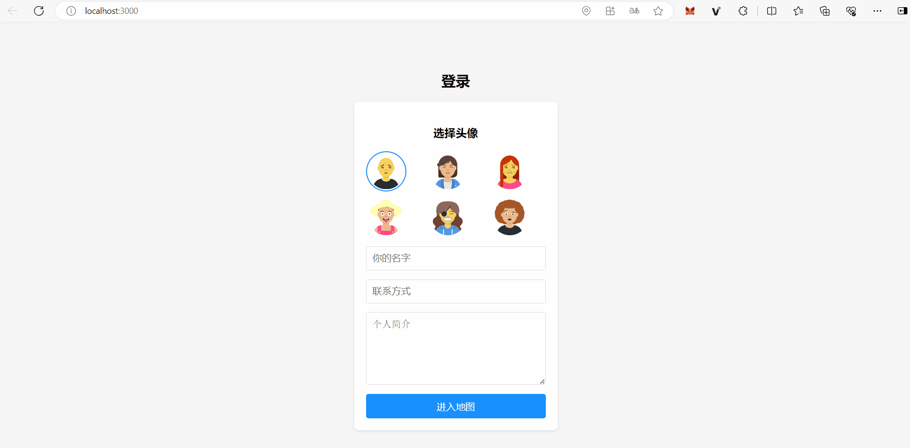

# 地图社交Web应用

基于React前端和Flask后端的实时地图社交平台，集成百度地图API实现用户位置展示和即时通讯功能

# 效果预览


## 功能特性
- 实时显示在线用户位置
- 点击用户标记查看联系方式
- 文字聊天功能
- 用户认证系统

## 技术栈
- 前端：React + @baidu/Map + Socket.io
- 后端：Flask + Flask-SocketIO + SQLAlchemy

## 安装运行
```bash
# 前端
cd frontend
npm install
npm start

# 后端
cd backend
python -m venv venv
venv\Scripts\activate
pip install -r requirements.txt
flask run
```